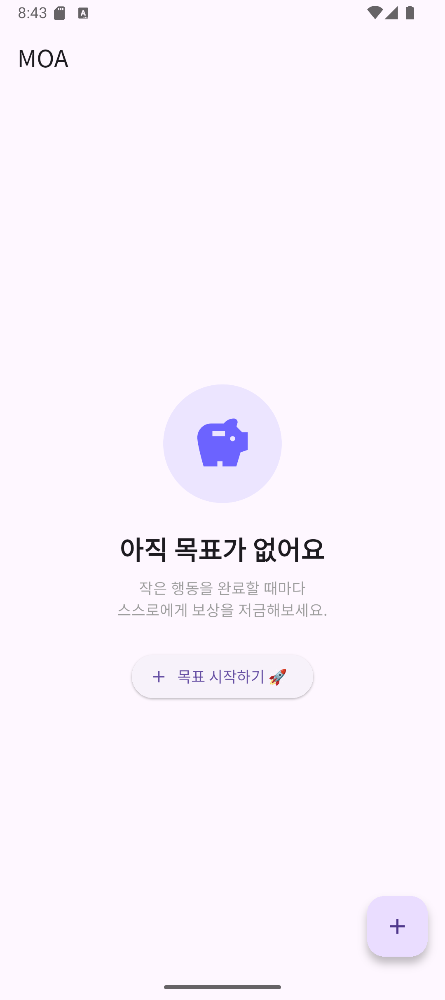
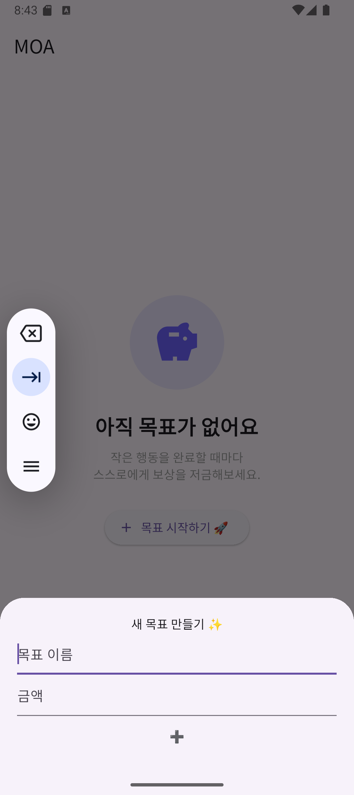
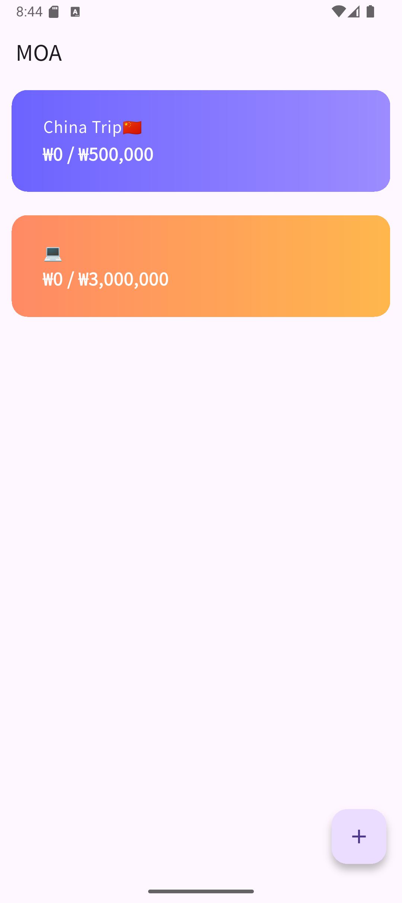
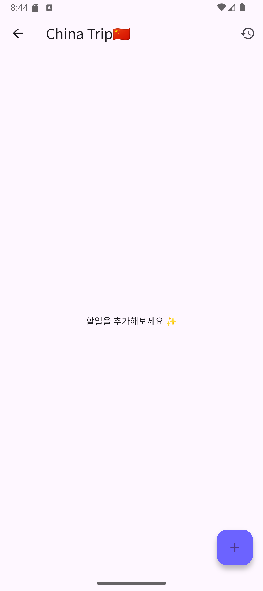
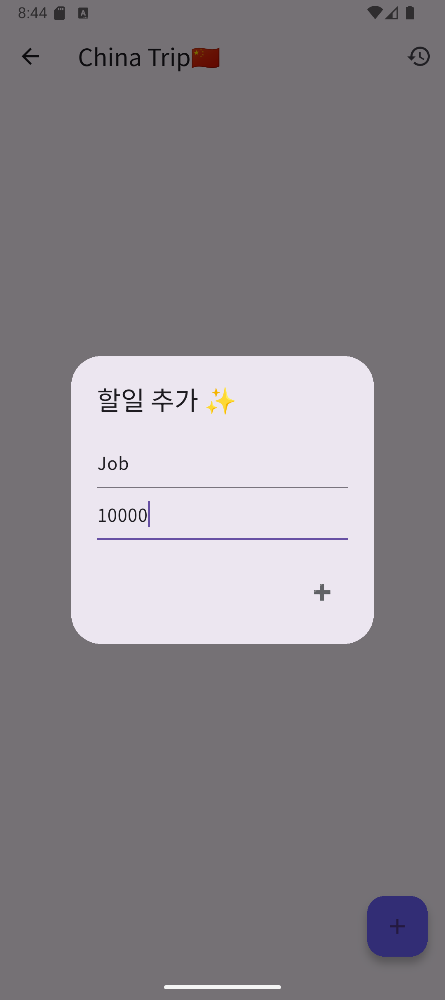
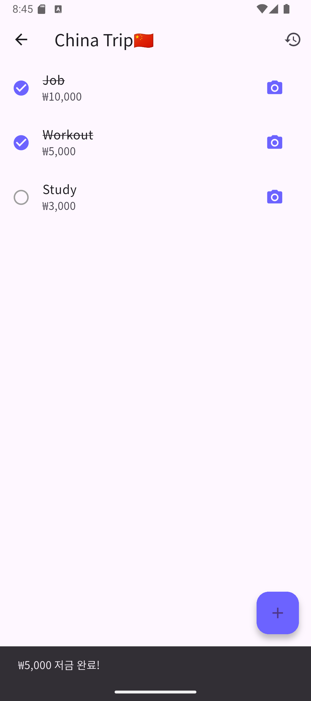
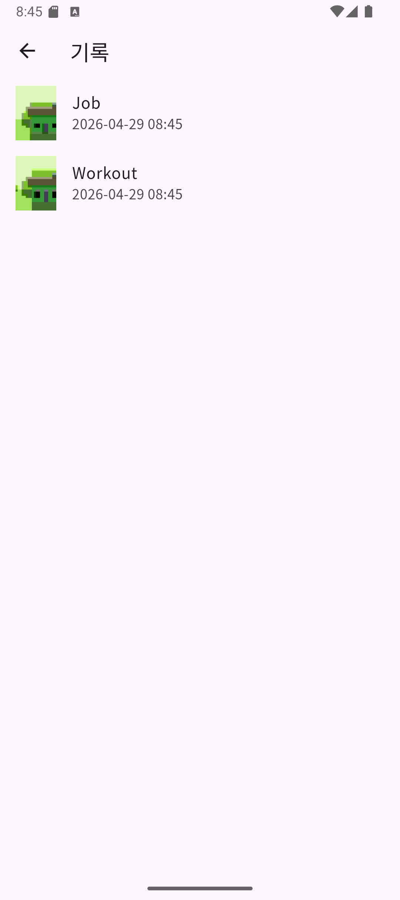
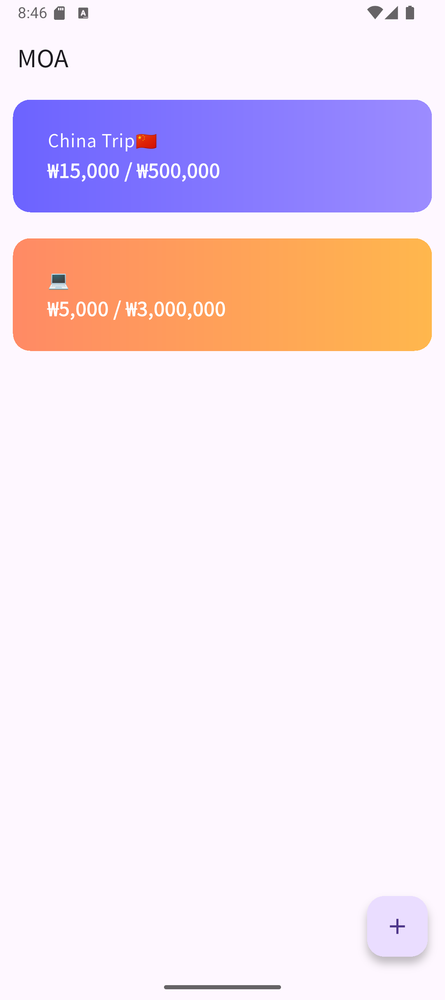

# 📱 MOA - 목표 달성 저금 앱

## 📝 프로젝트 개요

MOA는 사용자가 설정한 목표를 달성하기 위해 일상 속 할 일을 수행하고,

이를 완료할 때마다 스스로 정한 금액을 저금하는 방식의 앱이다.

단순한 To-Do List를 넘어,

**행동 → 인증 → 저금** 구조를 통해

사용자의 지속적인 동기부여와 자기관리를 유도한다.

인증샷 기능을 통해 실제 수행 여부를 확인하고,

목표 달성 과정을 기록으로 남길 수 있다.

---

## 🎯 주요 기능

### 1️⃣ 목표 관리

- 목표 이름과 금액 설정
- 목표별 색상 자동 적용 (UI 구분)

### 2️⃣ 할일(Task) 관리

- 할일 + 금액 직접 입력 가능
- Enter 키로 빠르게 추가 가능

### 3️⃣ 인증 시스템

- 카메라로 인증샷 촬영
- 인증 완료 시 자동 저금 반영
- 완료된 할일 체크 표시 + 취소선 적용

### 4️⃣ 기록 기능

- 완료된 할일 기록 확인
- 촬영한 이미지 + 날짜 표시

---

## 🎨 UI/UX 특징

- 목표별 색상으로 직관적인 구분
- 유도형 첫 화면 (목표 생성 유도)
- 이모지 버튼 (➕)으로 직관적 인터랙션
- 폰트 개선 (Google Fonts - NotoSansKR)
- 중요한 정보(금액) 강조 표시

---

## 🛠 사용 기술

| 기술 | 설명 |
| --- | --- |
| Flutter (Dart) | UI 및 앱 개발 |
| image_picker | 카메라 기능 |
| intl | 금액 포맷팅 |
| google_fonts | 폰트 스타일 |

---

## 📂 프로젝트 구조

- `HomeScreen` : 목표 목록 화면
- `GoalDetailScreen` : 할일 관리 및 인증
- `HistoryScreen` : 기록 확인
- `Goal / Task` : 데이터 모델

---

## 📜 License

This project is licensed under the MIT License.

---

## ▶ 실행 방법

```bash
flutter pub get
flutter run
```

---

## ✨ 본인이 구현한 부분

- 목표 기반 저금 시스템 설계
- 카메라 인증 후 금액 자동 반영 로직 구현
- 목표별 색상 UI 설계
- 완료 상태 시각적 표현 (체크 + 취소선)
- 기록 페이지 (이미지 + 시간 표시)

---

## 🤖 AI 활용 여부

- ChatGPT를 활용하여 UI 개선, 코드 구조 설계, 디버깅을 진행함
- 전체 로직 이해 후 직접 수정 및 기능 확장 수행

---

## 💡 향후 개선 방향

- 데이터 저장 기능 (로컬 DB / SharedPreferences)
- 애니메이션 추가
- 개인 계좌와 연결해서 자동으로 저금 시스템 구축

---

## 📸 실행 화면

실행 화면 이미지는 `images` 폴더에 포함되어 있습니다.










---
